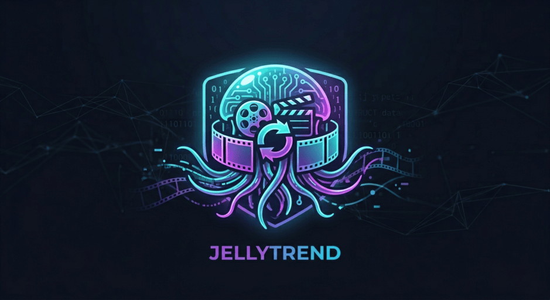
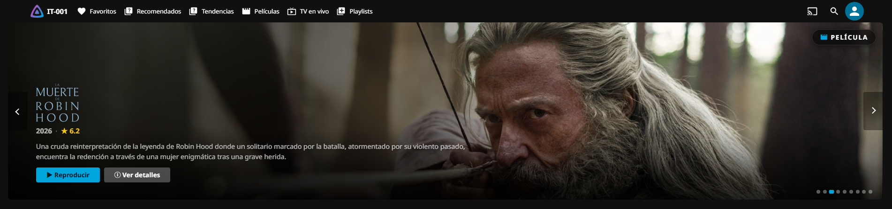
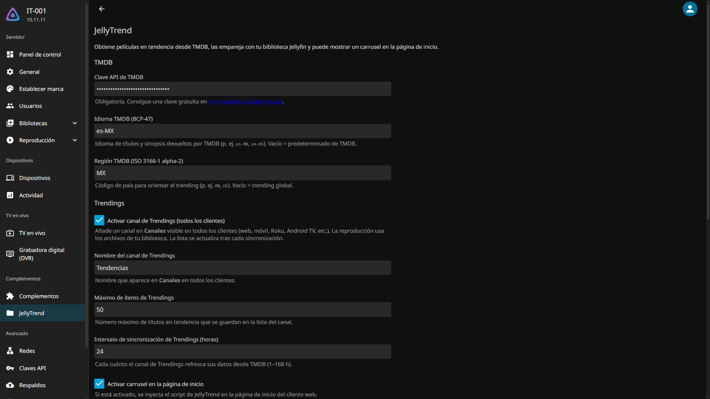
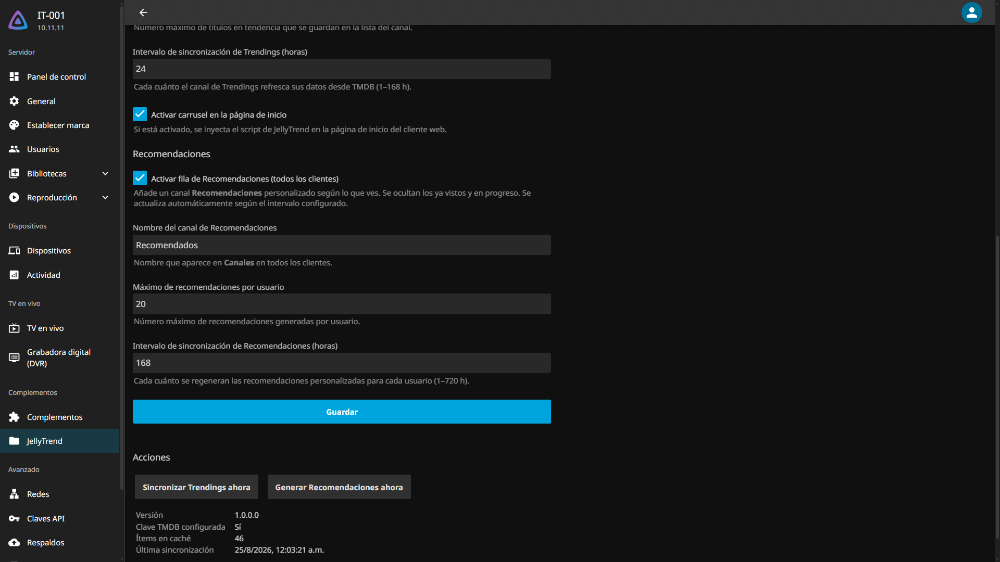
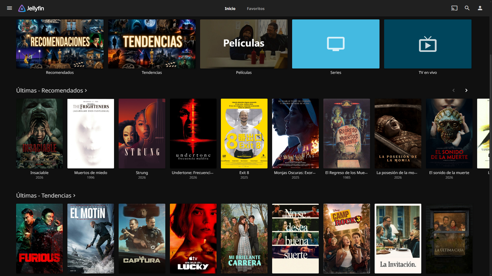

<div align="center">



🌐 &nbsp;**English**&nbsp; · &nbsp;[**Español**](README.md)

<br>

# 🎬 JellyTrend

**Jellyfin plugin** that syncs TMDB trends (movies **and TV shows**) with your local library,
shows a Netflix-style banner carousel on the home screen, and generates personalized
recommendations per user.

<br>

[](https://github.com/BORNIOS/JellyTrend/commits/main)
[](https://github.com/BORNIOS/JellyTrend/graphs/commit-activity)
[](https://github.com/BORNIOS/JellyTrend/actions/workflows/build.yaml)
[](https://jellyfin.org)
[](https://github.com/BORNIOS/JellyTrend/releases)

[](https://discord.jellyfin.org)
[](https://www.reddit.com/r/jellyfin)
[](LICENSE)

</div>

---

<br>



<br>

## ✨ Features

- 🎥 **Netflix-style banner carousel** on the Jellyfin Web home screen, per-user (hides what you already watched).
- 📡 **Two channels** under *Channels*: **Trending** (TMDB trends you **already have in your library**) and **Recommended** (personalized suggestions per user).
- ▶️ **100 % local playback** — TMDB only feeds the lists; your server is always the source.
- 📚 **Season navigation** in the **Trending** channel (series → season → episode) to start from whichever season you want.
- 🎯 **Personalized recommendations** per user: prioritize the best TMDB ratings, cap sagas (max 2 per franchise) and hide watched / in-progress items.
- 🔄 **Two-way sync** library ↔ channel: watched state, resume position, favorites, and ratings.
- 🔍 **Enriched metadata** — genres, cast, studios, tags, and parental rating from the library item (channels don't look like a "copy").

---

## ⚙️ Requirements

| | |
|---|---|
| **Server** | Jellyfin compatible with `Jellyfin.Controller` **10.11.x** |
| **TMDB** | Free API key from [themoviedb.org](https://www.themoviedb.org/settings/api) |

> ℹ️ The plugin only shows content that **already exists in your library**. If there are no
> matches (trends you don't own), the carousel row or the channel can look empty. That's normal.

---

## 🚀 Installation

### Option A — From the repository (recommended)

1. In Jellyfin go to **Dashboard → Advanced → Plugin repositories**.
2. Click **Add repository** and use the **manifest** URL:

   ```
   https://raw.githubusercontent.com/BORNIOS/JellyTrend/main/manifest.json
   ```

   > ⚠️ The URL must point to the `manifest.json` (Jellyfin uses it as-is). Adding
   > `https://github.com/BORNIOS/JellyTrend` **does not work**.

3. Save and go to **Catalog**, search for **JellyTrend** and **Install**.
4. Configure your TMDB key in **Dashboard → Plugins → JellyTrend**.
5. Restart Jellyfin if prompted.

### Option B — Manual

1. Download the latest release from [**Releases**](https://github.com/BORNIOS/JellyTrend/releases).
2. Copy the `.dll` file into your Jellyfin plugins directory.
3. Restart Jellyfin.
4. Go to **Dashboard → Plugins → JellyTrend** and enter your TMDB API key.

> 💡 Common plugin directory locations:
> - **Linux / Docker:** `/config/plugins/`
> - **Windows:** `%LOCALAPPDATA%\jellyfin\plugins\`

---

## 🛠️ Settings

From the plugin page you can configure:

| Section | Parameter | Description |
|---|---|---|
| **TMDB** | API key | Your The Movie Database API key (required) |
| **TMDB** | Language / Region | TMDB titles/synopsis; country to bias trending |
| **Trending** | Enable channel | Show the trending channel under *Channels* |
| **Trending** | Channel name | How it appears in *Channels* (e.g. «JellyTrend - Trending Now») |
| **Trending** | Max items | How many trending titles are kept |
| **Trending** | Interval (hours) | How often the list refreshes from TMDB (1–168 h) |
| **Trending** | Carousel | Show the banner on the home screen |
| **Recommendations** | Enable row | Show the per-user “Recommended” row |
| **Recommendations** | Channel name | How it appears in *Channels* (e.g. «Recomendados») |
| **Recommendations** | Max per user | How many recommendations are generated per user |
| **Recommendations** | Interval (hours) | How often they are rebuilt (1–720 h; 168 = weekly) |

The page also has two action buttons — **«Sync trending now»** and **«Build recommendations now»** —
plus a **status** section (version, TMDB key, cached items, last sync).

<br>

<p align="center">
  
  &nbsp;
  
</p>

---

## 📺 Channels

The plugin registers **two channels** visible under *Channels* in every client (web, mobile,
Roku, Android TV, iOS, etc.):

### 📡 Trending
- Shows the TMDB trending movies and shows that **you already have in your library** (matched by `TMDB id` during sync). **It never shows content you don't own.**
- **Movies**: playable directly from your library.
- **Shows**: appear as folders and are browsed by **season** (series → season → episode), so you pick which season to start from.

### 🎯 Recommended
- Per-user row/source built from each user's watch history.
- Content: **movies only** (no shows).
- Prioritizes the **best TMDB ratings**, caps sagas and **hides watched and in-progress items**.

<br>



---

## 🔄 Library ↔ Channel sync

Jellyfin creates a **shadow item** for each channel entry with its own internal `Id`. JellyTrend keeps both in sync:

- Mark a movie **watched in your library** → the channel reflects it automatically.
- Watch it **from the channel** → the library is updated too.
- **Continue watching** always uses the library item as the canonical source — the channel shadow intentionally does not store partial progress to avoid duplicate entries in that section.

<details>
<summary>🔧 Technical sync details</summary>

<br>

1. **Mirrors user data** (played, resume position, favorite, rating, etc.) between the library item and the channel shadow.
2. **Enriches `ChannelItemInfo`** with genres, studios, cast, tags, dates, and parental rating from the library item.
3. After each TMDB sync (and shortly after startup), **`TrendingShadowMetadataSync`** pushes cast and metadata into the shadow row (`UpdatePeopleAsync` and text fields) and references the library's image files directly — Jellyfin does not re-apply cast to existing shadows from `ChannelItemInfo` alone.

**Image note:** the web carousel (`/JellyTrend/Trending`) uses `/Items/{id}/Images/...` with the library `Id`, so backdrop, logo, etc. appear whenever they exist in your library.

</details>

---

## 📁 Data and file locations

The plugin stores its data inside the **Jellyfin data directory** (hereafter `{DataDir}`). On **Windows** this is usually `%LOCALAPPDATA%\jellyfin\`; on **Linux/Docker**, `/config/`.

| What | Path |
|---|---|
| Plugin (DLL) | `{DataDir}/plugins/Jellyfin.Plugin.JellyTrend/` |
| Plugin configuration | `{DataDir}/config/plugins/Jellyfin.Plugin.JellyTrend.xml` |
| Trending cache (trending.json) | `{DataDir}/plugins/Jellyfin.Plugin.JellyTrend/trending.json` |
| **Recommendations per user** | `{DataDir}/plugins/Jellyfin.Plugin.JellyTrend/recommendations/{userId}.json` |
| Channel art/cache | `{DataDir}/metadata/channels/` |

> 🗑️ **Reset your recommendations:** delete the `recommendations/{your-userId}.json` file
> (or run «Build recommendations now» again).

---

## 🖼️ Customizing the channel images

By default the channel images (**Trending** and **Recommended**) are embedded in the plugin.
Jellyfin stores the channel art under `{DataDir}/metadata/channels/`:

- **Windows:** `%LOCALAPPDATA%\jellyfin\metadata\channels\`
- **Linux / Docker:** `/config/metadata/channels/`

To **customize** a channel image: locate the channel folder inside that path, **replace the image
file** with yours (same name) and **restart Jellyfin** (or re-sync the channel from
*Dashboard → Channels*). You can also replace the source files `channel-trendings.png` and
`channel-recommendations.png` and rebuild if you want a custom default.

---

## ❓ FAQ

<details>
<summary><b>Why is the carousel or the channel empty?</b></summary>

1. Make sure the **TMDB key** is configured and reachable.
2. Confirm the **Carousel** option (banner) or **Enable channel** is on.
3. The plugin **only shows content you already have in your library**. If no TMDB trend matches your items (matched by `TMDB id`), the list is empty. Run «Sync trending now» and refresh.
</details>

<details>
<summary><b>Why are some TMDB trending titles missing?</b></summary>

By design, the plugin **does not add or show content that is not in your library**. Only trends
that match local items (movies and shows, by `TMDB id`) are shown. If you don't own the title,
it won't appear.
</details>

<details>
<summary><b>Does my data leave my server? Is it private?</b></summary>

**Playback is 100 % local.** TMDB is only queried for the **trending list** (titles and ids) and
metadata. **Recommendations are computed locally** from each user's history and stored on your
server (`recommendations/{userId}.json`). No watch history is sent to any external service.
</details>

<details>
<summary><b>How does it work with multiple users?</b></summary>

The **carousel and recommendations are per-user**: each user sees their own language, their own
watched/in-progress state and their own recommendations. Recommendations are built for **all**
users on each cycle.
</details>

<details>
<summary><b>Why do I see a whole saga recommended?</b></summary>

The algorithm caps recommendations at **2 per franchise** (e.g. max 2 of «Paranormal Activity»)
and prioritizes the **best TMDB ratings**. If you still see several from one saga, check that
your items have a rating in their metadata (usually from the `.nfo`).
</details>

<details>
<summary><b>How do I reset my recommendations?</b></summary>

Delete your file at `{DataDir}/plugins/Jellyfin.Plugin.JellyTrend/recommendations/{userId}.json`
or click **«Build recommendations now»** in the settings.
</details>

<details>
<summary><b>Can I change a channel image?</b></summary>

Yes. Replace the image file under `{DataDir}/metadata/channels/` and restart Jellyfin. See the
**«Customizing the channel images»** section.
</details>

<details>
<summary><b>Which channel has season navigation?</b></summary>

Only **Trending** (series → season → episode). **Recommended** contains **movies only**, so there
are no seasons.
</details>

<details>
<summary><b>How do I update the plugin?</b></summary>

If installed from the **repository**, Jellyfin shows the update automatically (Activities →
updates, or on restart). You can also download the `.dll` from
[Releases](https://github.com/BORNIOS/JellyTrend/releases) and replace it manually.
</details>

<details>
<summary><b>Why does the banner still show content I already watched?</b></summary>

The carousel refreshes automatically (up to every ~15 s) and hides watched titles. If the change
doesn't show, **reload the page** or return to the home screen. The filter uses the authenticated
user's state.
</details>

---

## 🌐 Internal API

| Endpoint | Description |
|---|---|
| `GET /JellyTrend/Trending` | Matched trends with genres, cast, and play state for the authenticated user |
| `GET /JellyTrend/Status` | Configuration and cache summary |
| `GET /JellyTrend/jellyTrend.js` | Carousel script |
| `GET /JellyTrend/jellyTrend.css` | Carousel styles |

---

## 🧑‍💻 Development

The project follows the layout of the [official Jellyfin plugin template](https://github.com/jellyfin/jellyfin-plugin-template):
the source code lives in `Jellyfin.Plugin.JellyTrend/` and the root holds the repository
manifests, the analyzers configuration and the CI workflows.

```bash
# Build the plugin (Release)
dotnet build Jellyfin.Plugin.JellyTrend.sln -c Release

# Publish a standalone plugin output
dotnet publish Jellyfin.Plugin.JellyTrend/Jellyfin.Plugin.JellyTrend.csproj -c Release -o publish
```

Copy the generated `Jellyfin.Plugin.JellyTrend.dll` into your Jellyfin plugins folder
(e.g. `%LOCALAPPDATA%\jellyfin\plugins\Jellyfin.Plugin.JellyTrend\`) and restart the server.

### Debugging with VS Code

The repo includes a `.vscode/` setup with tasks that build the plugin, copy it into your
plugins folder and let you debug against a running server. **Local paths are configured once in a
`.env` file** (copy `.env.example` to `.env` and adjust):

```dotenv
JELLYFIN_SERVER_DIR=D:\jellyfin-portable          # where jellyfin.exe / jellyfin.dll live
JELLYFIN_WEB_DIR=D:\jellyfin-portable\jellyfin-web
JELLYFIN_DATA_DIR=C:\Users\<your-user>\AppData\Local\jellyfin
```

Workflow:

1. **Stop Jellyfin** (on Windows the DLL is locked while the server runs).
2. Run the VS Code **`build-and-copy`** task: builds in Debug and copies `DLL + PDB` to `$JELLYFIN_DATA_DIR/plugins/$PLUGIN_NAME/`.
3. Run the **`start-server`** task: starts your portable Jellyfin.
4. Press **F5** → **Attach to Jellyfin** and pick the `jellyfin` process.

The VS Code tasks (`build`, `build-and-copy`, `start-server`, `dev-info`) load the `.env`
automatically; use **`dev-info`** to verify the paths exist.

### Code quality

The project enables the Jellyfin analyzers (StyleCop, Serilog, Multithreading) with
warnings-as-errors. Keep the build clean:

```bash
dotnet build Jellyfin.Plugin.JellyTrend.sln -c Release   # must report 0 warnings / 0 errors
```

---

## 🤝 Community

Found a bug or have a suggestion? Open an [issue](https://github.com/BORNIOS/JellyTrend/issues) or join the official Jellyfin community:

[](https://discord.jellyfin.org)
[](https://www.reddit.com/r/jellyfin)

---

<div align="center">

Made with ❤️ for the Jellyfin community &nbsp;·&nbsp; [⭐ Star on GitHub](https://github.com/BORNIOS/JellyTrend)

</div>
