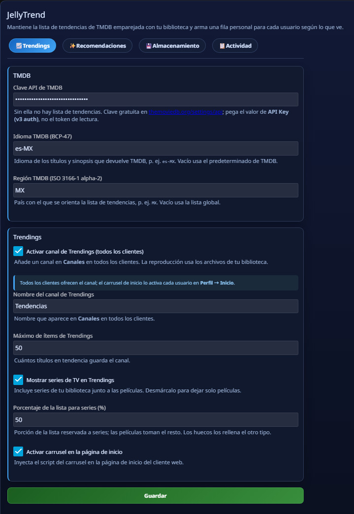
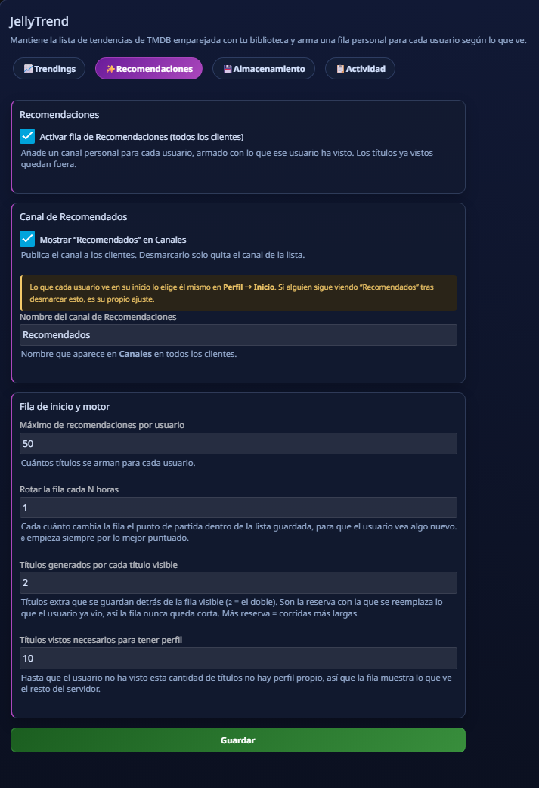
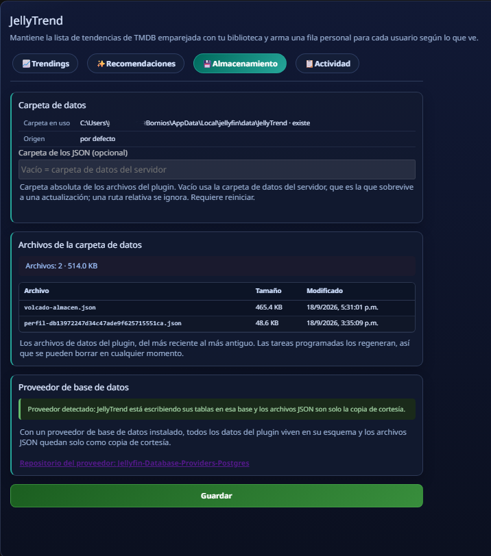
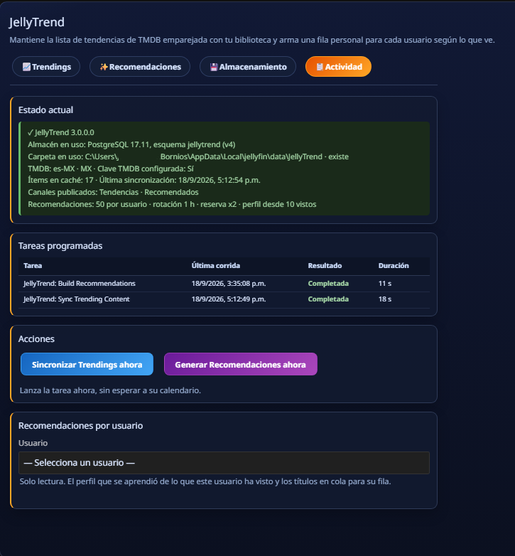
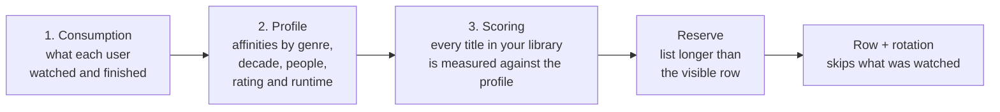
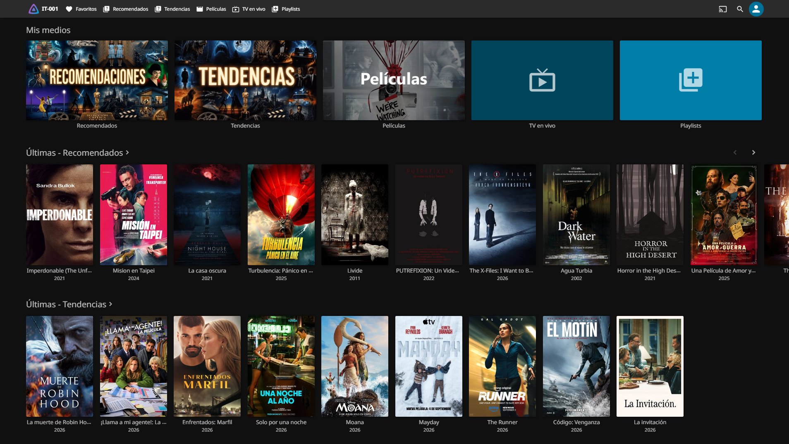

<div align="center">


🌐 &nbsp;**English**&nbsp; · &nbsp;[**Español**](README.md)

<br>

# 🎬 JellyTrend

**Jellyfin 12 plugin** that keeps the TMDB trending list matched to your library, publishes two
channels (*Trending* and *Recommended*) in every client, and builds a personal row for each user
out of what that user actually watches.

<br>

[](https://github.com/BORNIOS/JellyTrend/commits/main)
[](https://github.com/BORNIOS/JellyTrend/actions/workflows/build.yaml)
[](https://jellyfin.org)
[](https://github.com/BORNIOS/JellyTrend/releases)
[](https://github.com/BORNIOS/JellyTrend/releases)
[](LICENSE)

[](https://discord.jellyfin.org)
[](https://www.reddit.com/r/jellyfin)

</div>

---


<p align="center"><em>The carousel on the home page: synopsis, rating and the “Play” and “Details” buttons.</em></p>

---

## 🆕 What 3.0.0 brings

This release changes **how recommendations are made** and **where the data lives**. Installing is
the same as always: the trending list is no longer the point, each **user's own profile** is.

| What's new | What it means for you |
|---|---|
| 🧠 **It learns each user's taste** | The engine summarises what a user has watched, learns their affinities (genres, decades, people, ratings, runtime…) and scores every title in your library against that profile. It is no longer just "the best rated on TMDB". |
| 🌱 **Cold start** | While a user has not watched enough titles, their row is built from what the rest of the server watches. As soon as they reach the threshold, it switches to their own profile. The threshold is configurable. |
| 🔁 **Reserve and rotation** | The stored list is **longer than the visible row**, so every few hours the row starts from a different point and watched titles are replaced without the row ever coming up short. |
| 🎚️ **Series / movies split** | The *Trending* channel reserves a percentage of the list for series and gives the rest to movies; leftover slots are filled with the other type. |
| 👥 **One channel per user, no leaks** | Channel items are materialised for **all** users (they no longer depend on somebody opening the channel) and each channel keeps its own per-user cache: one user's row never leaks into another's. |
| 🧩 **New panel, matching the PostgreSQL provider** | Four tabs, its own icon in the sidebar, English and Spanish texts, and the real state of storage (backend, schema, folder and the files that are actually on disk). |
| 🗄️ **Optional PostgreSQL store** | With the database provider installed, the data lives in a **schema of its own** (`jellytrend`) with history. The JSON files become a courtesy copy only. |
| 🕘 **Run history** | Every task execution is recorded (result, users, duration) and shown on the **Activity** tab next to the last run result. |
| ⚡ **It learns when something finishes** | The profile is refreshed from playback events, without waiting for the scheduled run. |

---

## ✨ What it does

- 🎥 **Netflix-style carousel** on the web client home page, personalised per user (watched titles are hidden).
- 📡 **Two channels** under *Channels*, visible in every client (web, mobile, Roku, Android TV, iOS…).
- ▶️ **100 % local playback**: TMDB only feeds the lists; the source is always your server.
- 📚 **Season browsing** on the *Trending* channel (series → season → episode).
- 🔄 **Library ↔ channel sync**: played state, progress, favourites and ratings in both directions.
- 🔍 **Enriched metadata** on channel items (genres, cast, studios, tags, rating and local images), so they do not look like a copy.
- 🗄️ **Optional PostgreSQL store** — with the [database provider](https://github.com/BORNIOS/Jellyfin-Database-Providers-Postgres) the data lives in the `jellytrend` schema of your database, with run history, and recommendations are computed with optimized native SQL.

---

## ⚙️ Requirements

| | |
|---|---|
| **Server** | Jellyfin compatible with `Jellyfin.Controller` **12.1.x** |
| **TMDB** | Free API key from [themoviedb.org/settings/api](https://www.themoviedb.org/settings/api) |
| **Optional** | [Jellyfin Database Providers: PostgreSQL](https://github.com/BORNIOS/Jellyfin-Database-Providers-Postgres) for the store with history |

> ℹ️ The plugin **only shows content you already have in your library**. If a TMDB trending title
> matches nothing of yours, it is simply not shown. That is expected.

---

## 🚀 Installation

### Option A — From the repository (recommended)

1. In Jellyfin go to **Dashboard → Plugins → Repositories**.
2. Click **Add repository** and use the manifest URL:

   ```
   https://raw.githubusercontent.com/BORNIOS/JellyTrend/main/manifest.json
   ```
3. Save, open the **Catalog**, find **JellyTrend** and **Install**.
4. Restart Jellyfin when asked.
5. Go to **Dashboard → Plugins → JellyTrend** and set your TMDB key.

### Option B — Manual

1. Download the latest release from [**Releases**](https://github.com/BORNIOS/JellyTrend/releases).
2. Copy the `.dll` into your installation's plugins folder.
3. Restart Jellyfin and set your TMDB key.

> 💡 Usual plugin folders:
> - **Linux / Docker:** `/config/plugins/`
> - **Windows:** `%LOCALAPPDATA%\jellyfin\plugins\`

---

## 🎛️ The panel, tab by tab

The panel is the plugin's only interface: four tabs with every setting and every piece of status.
The screenshots were taken with the client in Spanish; the panel **follows each user's language**
(English and Spanish included).

### 📈 Trending



| Setting | What it is for |
|---|---|
| **TMDB API key** | Required. Paste the *API Key (v3 auth)* value, not the read token |
| **TMDB language (BCP-47)** | Language of the titles and synopses TMDB returns (e.g. `es-MX`) |
| **TMDB region (ISO 3166-1 alpha-2)** | Country used to bias the trending list (e.g. `MX`) |
| **Enable Trending channel** | Publishes the channel under *Channels* in every client |
| **Channel name** | How it appears under *Channels* (defaults to a localised name) |
| **Max trending items** | How many trending titles the channel keeps |
| **Show TV series** | Include series next to movies; uncheck to keep movies only |
| **Share of the list for TV series** | Portion reserved for series; movies take the rest and leftover slots are filled |
| **Enable banner carousel on home** | Injects the carousel into the web client home page |

> The channel is **offered** to every client. Whether a user sees it at home is their own choice
> in **Profile → Home**, and the plugin never overrides it.

### ✨ Recommendations



| Setting | What it is for |
|---|---|
| **Enable recommendations row** | Publishes each user's personal channel |
| **Show “Recomendados” under Channels** | Publish it in the clients' *Channels* list |
| **Channel name** | How it appears under *Channels* (defaults to `Recomendados`) |
| **Max recommendations per user** | How many titles are built for each user |
| **Rotate the row every N hours** | How often the row changes its starting point inside the stored list. `0` always starts with the best ranked |
| **Titles generated per visible title** | The reserve: with `2` twice as many titles are stored, and they are what replaces watchers' already watched titles. More reserve means longer runs |
| **Watched titles needed to have a profile** | Until a user has watched that many titles, the row shows what the rest of the server watches |

### 💾 Storage



| Item | What it tells you |
|---|---|
| **Folder in use / Origin** | Where the plugin writes its files and where that folder comes from (default or custom) |
| **JSON folder** | Optional absolute folder. Empty uses the server data folder, the one that survives an update |
| **Files in the data folder** | What is really on disk, with size and date. The tasks rebuild them, so they can be deleted |
| **Database provider** | With a provider installed the data lives in its schema and the JSON files are a courtesy copy only |

### 📋 Activity



| Item | What it tells you |
|---|---|
| **Current state** | Version, store and schema version, folder, TMDB, cache with the last sync, published channels and the engine settings on one line |
| **Scheduled tasks** | Last run of each plugin task, colour-coded result and duration |
| **Actions** | **Sync trending now** and **Build recommendations now**, without waiting for the schedule |
| **Recommendations per user** | Pick a user to see the profile learned from their history and the titles queued for their row |

---

## 🧠 How it learns each user's taste

Three steps, on every recommendations run:



- **Affinities are normalised per family**: a family (say *actors*) shares its own weight, so one
  very specific affinity never flattens a whole genre.
- **Combined affinities**: on top of that, the engine learns crossed pairs (an actor *and* a decade,
  a genre *and* a runtime) and adds a bonus when a title satisfies them.
- **How hard the interaction was matters**: finishing a title does not weigh the same as leaving it
  half watched, or marking it as a favourite.
- **Quality breaks ties**: TMDB and library ratings decide between equally close titles, never above
  taste.
- **No profile yet**: when a user has not watched enough, the row is built from **local popularity**
  (what the rest of the server watches, favourites and finishes) and switches to their own profile
  automatically.

---

## ⚡ Storage: JSON files or a database

JellyTrend works on any database Jellyfin uses (SQLite by default). On top of that, it **detects by
itself** whether you have the [**PostgreSQL Database Provider**](https://github.com/BORNIOS/Jellyfin-Database-Providers-Postgres)
installed, and then it gets **two things** out of it:

| Role | What it does |
|---|---|
| 🗄️ **Data store** | JellyTrend keeps everything in a **schema of its own** (`jellytrend`) inside your database: feature cache, trending list, per-user taste profiles and recommendations, hidden titles and run history. The schema lives **outside `public`**, so it never shows up in a SQLite export and never gets in the way of the provider's diagnostics |
| 🔍 **Query accelerator** | The recommendation engine swaps `ILibraryManager` queries for native SQL with GIN indexes — **4-10× faster** on large libraries |

| | |
|---|---|
| **Without the provider** | The data lives in the JSON files of the server data folder |
| **With the provider** | The data lives in the `jellytrend` schema and the JSON files are still written **as a courtesy copy only** |

> ✅ There is nothing to configure: if the provider is there it is used, and if not the plugin works
> exactly the same. The schema is created by the plugin on first use, **never touches Jellyfin's own
> tables**, and its version is shown on the **Activity** tab.

---

## 📡 The two channels



<p align="center"><em>Both channels under “My Media” and their home rows: “Latest - Recommended” and “Latest - Trending”.</em></p>

### Trending

- Shows the TMDB trending movies and series that **you already have in your library** (matched by
  `TMDB id` during the sync). **It never shows content you do not have.**
- **Movies**: playable straight from your library.
- **Series**: shown as folders and browsed by seasons, so you can pick where to start.

### Recommended

- **Per-user** channel, built from what that user has watched.
- **Hides what has been watched or is in progress.**
- Rotates its starting point every N hours (configurable) using the stored reserve of titles.

---

## ⏱️ Scheduled tasks

The plugin registers two tasks under **Dashboard → Scheduled Tasks**, and that is where their
**schedule** is changed (the plugin does not impose one):

| Task | What it does |
|---|---|
| **JellyTrend: Sync Trending Content** | Refreshes the TMDB list, matches it to your library and materialises the channel items for every user |
| **JellyTrend: Build Recommendations** | Rebuilds every user's profile and generates their list with the configured reserve |

Every run is recorded (result, users processed and duration) and shown on the **Activity** tab,
where you can also launch either task by hand.

---

## 📁 File paths

Everything the plugin stores lives inside the Jellyfin data directory (`{DataDir}`):
`%LOCALAPPDATA%\jellyfin` on Windows, `/config` on Linux/Docker.

| What | Path |
|---|---|
| Plugin (DLL) | `{DataDir}/plugins/JellyTrend_3.0.0.0/` |
| Plugin configuration | `{DataDir}/plugins/configurations/Jellyfin.Plugin.JellyTrend.xml` |
| Plugin data | `{DataDir}/data/JellyTrend/` |
| Per-user profile | `{DataDir}/data/JellyTrend/perfil-{userId}.json` |
| Per-user stored list | `{DataDir}/data/JellyTrend/recommendations/{userId}.json` |
| Courtesy dump of the store | `{DataDir}/data/JellyTrend/volcado-almacen.json` |
| Channel art | `{DataDir}/metadata/channels/` |

> 🗑️ **Reset one user's recommendations:** delete their file under `recommendations/` (or run the
> task again). With the database provider, run **Build recommendations now** from the **Activity** tab.

---

## 🖼️ Customising the channel images

The channel images (*Trending* and *Recommended*) ship embedded in the plugin by default. Jellyfin
keeps channel art under `{DataDir}/metadata/channels/`:

- **Windows:** `%LOCALAPPDATA%\jellyfin\metadata\channels\`
- **Linux / Docker:** `/config/metadata/channels/`

To customise one, find the channel folder, **replace the image file** with yours (same name) and
restart Jellyfin. You can also replace `channel-trendings.png` and `channel-recommendations.png`
under `Resources/` in the source and rebuild.

---

## ❓ FAQ

<details>
<summary><b>Why is the row or the channel empty?</b></summary>

1. Check that the **TMDB key** is set and that the server has internet access.
2. Open the **Activity** tab: if the last run ended **with an error** it shows in red, and under
   **Actions** you can run it again by hand.
3. Remember the plugin **only shows content you already have**. If no trending title matches your
   items the list is empty, and that is expected.
</details>

<details>
<summary><b>Why does it store 50 titles when I only see 20 in the row?</b></summary>

That is on purpose: the **reserve**. The visible row is short, but more titles are stored behind it
so the rotation can replace what the user has already watched without shortening the row. It is
controlled by **Titles generated per visible title**.
</details>

<details>
<summary><b>Why does a brand-new user get recommendations?</b></summary>

That is the **cold start**: until they reach the watched-titles threshold their row is built from
what the rest of the server watches. As soon as they reach it, their own profile takes over.
</details>

<details>
<summary><b>Can I force a user to see the channel on their home screen?</b></summary>

No. The plugin **offers** the channel; whether a user sees it at home is their own choice in
Jellyfin (**Profile → Home**). Unchecking it in the panel only removes the channel from the list.
</details>

<details>
<summary><b>Does my data leave my server?</b></summary>

No. Playback is 100 % local and recommendations are computed and stored on your server. TMDB is
only queried for the **trending list** (titles and ids) and their metadata.
</details>

<details>
<summary><b>What happens if I remove the PostgreSQL plugin?</b></summary>

Nothing is lost: the JSON files in the data folder are still there as a **courtesy copy** and the
plugin goes back to reading from them. The `jellytrend` schema never touches Jellyfin's tables.
</details>

<details>
<summary><b>Can I move the data files somewhere else?</b></summary>

Yes: on the **Storage** tab you can set an **absolute** folder (a relative path is ignored).
A server restart is required for every task to use it, and the panel warns you when the folder
cannot be used.
</details>

---

## 🧩 Compatibility and scope

| | |
|---|---|
| **Jellyfin** | 12.1.x (`net10.0`) |
| **Database** | Any database Jellyfin uses; the plugin's own store requires the PostgreSQL provider |
| **Content** | Movies and series **from your library only**; the *Recommended* channel builds movies only |

---

## 🤝 Community

Questions, suggestions or found a bug? Open an [issue](https://github.com/BORNIOS/JellyTrend/issues) or join the official Jellyfin community:

[](https://discord.jellyfin.org)
[](https://www.reddit.com/r/jellyfin)

---

## 📄 License

This project is distributed under the license included in [LICENSE](LICENSE).

---

<div align="center">

Made with ❤️ for the Jellyfin community &nbsp;·&nbsp; [⭐ Star on GitHub](https://github.com/BORNIOS/JellyTrend) &nbsp;·&nbsp; [⬆ Back to top](#-jellytrend)

</div>
