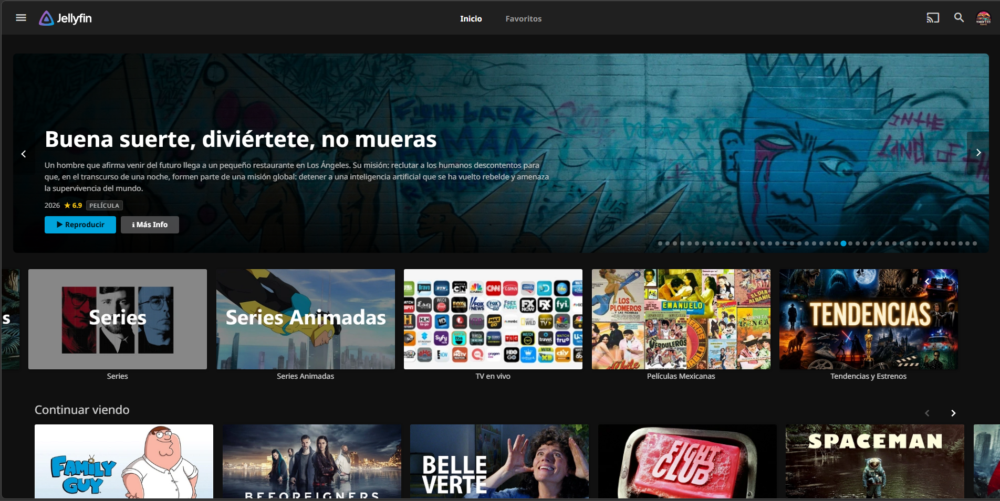
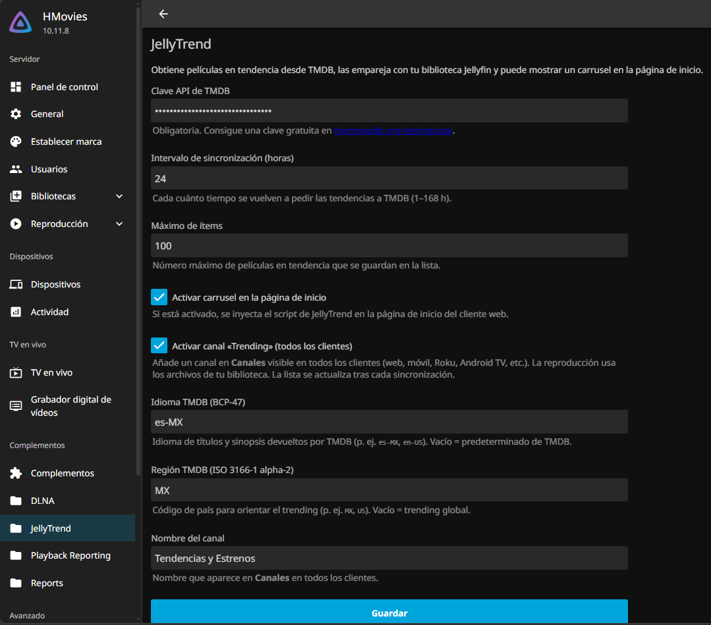
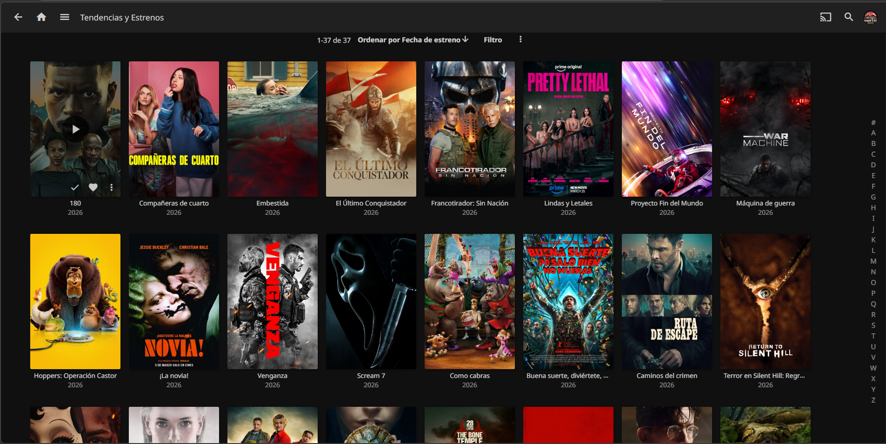

<div align="center">

🌐 &nbsp;[**English**](README.en.md)&nbsp; · &nbsp;**Español**

<br>

# 🎬 JellyTrend

**Plugin para Jellyfin** que sincroniza las películas en tendencia de TMDB con tu biblioteca local  
y ofrece un carrusel estilo Netflix en la pantalla de inicio.

<br>

[](https://github.com/BORNIOS/JellyTrend/commits/main)
[](https://github.com/BORNIOS/JellyTrend/graphs/commit-activity)
[](https://jellyfin.org)
[](https://github.com/BORNIOS/JellyTrend/releases)

[](https://discord.jellyfin.org)
[](https://www.reddit.com/r/jellyfin)
[](LICENSE)

</div>

---

<br>



<br>

## ✨ Características

- 🎥 **Carrusel estilo Netflix** en la pantalla de inicio de Jellyfin Web
- 📡 **Canal dedicado** en la sección *Canales* con las películas en tendencia y listas para reproducir
- 🔄 **Sincronización bidireccional** con tu biblioteca: estado visto, progreso de reproducción, favoritos y valoración
- 🛡️ **Reproducción 100 % local** — TMDB solo alimenta la lista de tendencias; la fuente siempre es tu servidor
- 🔍 **Metadatos enriquecidos** — géneros, reparto, estudios y clasificación tomados del ítem de biblioteca

---

## ⚙️ Requisitos

| | |
|---|---|
| **Servidor** | Jellyfin compatible con `Jellyfin.Controller` 10.11.x |
| **TMDB** | Clave de API gratuita en [themoviedb.org](https://www.themoviedb.org/settings/api) |

---

## 🚀 Instalación

1. Descarga la última versión desde [**Releases**](https://github.com/BORNIOS/JellyTrend/releases).
2. Copia el archivo `.dll` en el directorio de plugins de tu instalación de Jellyfin.
3. Reinicia Jellyfin.
4. Ve a **Panel → Plugins → JellyTrend** y configura tu clave de TMDB.

> 💡 Ubicaciones comunes del directorio de plugins:
> - **Linux / Docker:** `/config/plugins/`
> - **Windows:** `%APPDATA%\Jellyfin\plugins\`

---

## 🛠️ Configuración

Desde la página del plugin puedes ajustar:

| Parámetro | Descripción |
|---|---|
| **Clave TMDB** | Tu API key de The Movie Database |
| **Idioma / Región** | Para filtrar tendencias por localización |
| **Nombre del canal** | Cómo aparecerá en la sección Canales |
| **Canal activo** | Activa o desactiva el canal de tendencias |
| **Máximo de ítems** | Cuántas películas se sincronizan por ciclo |
| **Intervalo de sync** | Con qué frecuencia se actualiza la lista |

<br>



---

## 📺 Canal de tendencias

El canal aparece en la sección **Canales** de Jellyfin con las mismas películas en tendencia, listas para reproducir directamente desde tu biblioteca.

<br>



---

## 🔄 Sincronía biblioteca ↔ canal

Jellyfin crea un **ítem sombra** por cada entrada del canal con su propio `Id` interno. JellyTrend mantiene ambos alineados:

- Si marcas una película como **vista en tu biblioteca**, el canal lo reflejará automáticamente.
- Si la reproduces **desde el canal**, la biblioteca queda igualmente actualizada.
- **Continuar viendo** usa siempre el ítem de biblioteca como referencia canónica — el canal no guarda progreso parcial para evitar duplicados en esa sección.

<details>
<summary>🔧 Detalles técnicos de sincronización</summary>

<br>

1. **Replica datos de usuario** (visto, posición, favoritos, valoración) entre el ítem de biblioteca y el ítem sombra del canal, vía eventos de reproducción y el pipeline de guardado del servidor.
2. **Enriquece `ChannelItemInfo`** con géneros, estudios, reparto, fechas y clasificación, tomados del ítem de biblioteca.
3. Tras cada sync TMDB (y tras el arranque del servidor), **`TrendingShadowMetadataSync`** vuelca reparto y metadatos al ítem sombra en base de datos (`UpdatePeopleAsync`, campos de texto y `UpdateImagesAsync`), porque Jellyfin no reaplica el reparto a sombras ya existentes solo con el canal.

**Nota sobre imágenes del canal:** el modelo de canales expone una URL principal por ítem. El carrusel web (`/JellyTrend/Trending`) usa `/Items/{id}/Images/...` con el Id de la biblioteca, por lo que backdrop, logo, etc., aparecen cuando existen en tu biblioteca.

</details>

---

## 🌐 API interna

| Endpoint | Descripción |
|---|---|
| `GET /JellyTrend/Trending` | Lista en tendencia con géneros, actores y estado de reproducción |
| `GET /JellyTrend/Status` | Resumen de configuración y caché |
| `GET /JellyTrend/jellyTrend.js` | Script del carrusel |
| `GET /JellyTrend/jellyTrend.css` | Estilos del carrusel |

---

## 🧑‍💻 Desarrollo

```bash
dotnet build
```

Copia el ensamblado generado al directorio de plugins de Jellyfin según tu instalación y reinicia el servidor.

---

## 🤝 Comunidad

¿Dudas, sugerencias o has encontrado un bug? Abre un [issue](https://github.com/BORNIOS/JellyTrend/issues) o únete a la comunidad oficial de Jellyfin:

[](https://discord.jellyfin.org)
[](https://www.reddit.com/r/jellyfin)

---

<div align="center">

Hecho con ❤️ para la comunidad Jellyfin &nbsp;·&nbsp; [⭐ Star en GitHub](https://github.com/BORNIOS/JellyTrend)

</div>