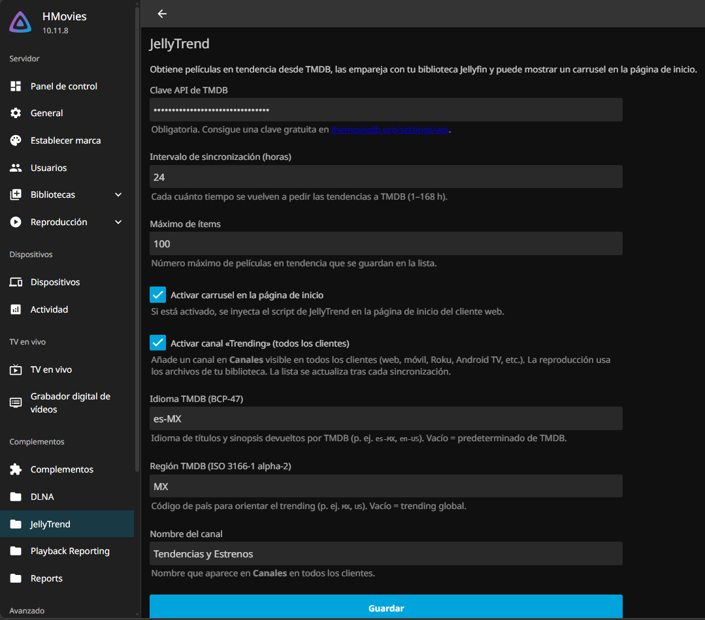

<div align="center">


🌐 &nbsp;[**English**](README.en.md)&nbsp; · &nbsp;**Español**

<br>

# 🎬 JellyTrend

**Plugin para Jellyfin** que sincroniza las películas en tendencia de TMDB con tu biblioteca local
y ofrece un carrusel estilo Netflix en la pantalla de inicio.

<br>

[](https://github.com/BORNIOS/JellyTrend/commits/main)
[](https://github.com/BORNIOS/JellyTrend/graphs/commit-activity)
[](https://github.com/BORNIOS/JellyTrend/actions/workflows/build.yaml)
[](https://jellyfin.org)
[](https://github.com/BORNIOS/JellyTrend/releases)

[](https://discord.jellyfin.org)
[](https://www.reddit.com/r/jellyfin)
[](LICENSE)

</div>

---

<br>


<br>

## ✨ Características

- 🎥 **Carrusel estilo Netflix** en la pantalla de inicio de Jellyfin Web
- 📡 **Canal dedicado** en la sección *Canales* con las películas en tendencia y listas para reproducir
- 🔄 **Sincronización bidireccional** con tu biblioteca: estado visto, progreso de reproducción, favoritos y valoración
- 🎯 **Recomendaciones personalizadas** por usuario (fila «Recomendados»), priorizando las mejores calificaciones de TMDB y ocultando lo ya visto
- 📚 **Navegación por temporadas** en los canales (serie → temporada → episodio)
- 🛡️ **Reproducción 100 % local** — TMDB solo alimenta la lista de tendencias; la fuente siempre es tu servidor
- 🔍 **Metadatos enriquecidos** — géneros, reparto, estudios, tags y clasificación tomados del ítem de biblioteca

---

## ⚙️ Requisitos

| | |
|---|---|
| **Servidor** | Jellyfin compatible con `Jellyfin.Controller` 10.11.x |
| **TMDB** | Clave de API gratuita en [themoviedb.org](https://www.themoviedb.org/settings/api) |

---

## 🚀 Instalación

### Opción A — Desde el repositorio (recomendada)

1. En Jellyfin ve a **Panel → Avanzado → Repositorios de plugins**.
2. Pulsa **Añadir repositorio** y usa la URL del manifest:

   ```
   https://raw.githubusercontent.com/BORNIOS/JellyTrend/main/manifest.json
   ```

3. Guarda y ve a **Catálogo**, busca **JellyTrend** e **Instala**.
4. Configura tu clave de TMDB en **Panel → Plugins → JellyTrend**.

### Opción B — Manual

1. Descarga la última versión desde [**Releases**](https://github.com/BORNIOS/JellyTrend/releases).
2. Copia el archivo `.dll` en el directorio de plugins de tu instalación de Jellyfin.
3. Reinicia Jellyfin.
4. Ve a **Panel → Plugins → JellyTrend** y configura tu clave de TMDB.

> 💡 Ubicaciones comunes del directorio de plugins:
> - **Linux / Docker:** `/config/plugins/`
> - **Windows:** `%APPDATA%\Jellyfin\plugins\`

---

## 🛠️ Configuración

Desde la página del plugin puedes ajustar:

| Sección | Parámetro | Descripción |
|---|---|---|
| **TMDB** | Clave API | Tu API key de The Movie Database |
| **TMDB** | Idioma / Región | Para filtrar tendencias por localización |
| **Trendings** | Activar canal | Muestra el canal de tendencias en *Canales* |
| **Trendings** | Nombre del canal | Cómo aparece en la sección Canales |
| **Trendings** | Máximo de ítems | Cuántos títulos en tendencia se guardan |
| **Trendings** | Intervalo (horas) | Cada cuánto se actualiza la lista desde TMDB |
| **Trendings** | Carrusel | Muestra el banner en la página de inicio |
| **Recomendaciones** | Activar fila | Muestra la fila «Recomendados» por usuario |
| **Recomendaciones** | Nombre del canal | Cómo aparece en la sección Canales |
| **Recomendaciones** | Máximo por usuario | Cuántas recomendaciones se generan por usuario |
| **Recomendaciones** | Intervalo (horas) | Cada cuánto se regeneran las recomendaciones |

<br>



---

## 📺 Canal de tendencias

El canal aparece en la sección **Canales** de Jellyfin con las mismas películas en tendencia, listas para reproducir directamente desde tu biblioteca. Las **series** se navegan por **temporadas** (serie → temporada → episodio) para que puedas empezar a ver desde la temporada que te interesa.

<br>


---

## 🔄 Sincronía biblioteca ↔ canal

Jellyfin crea un **ítem sombra** por cada entrada del canal con su propio `Id` interno. JellyTrend mantiene ambos alineados:

- Si marcas una película como **vista en tu biblioteca**, el canal lo reflejará automáticamente.
- Si la reproduces **desde el canal**, la biblioteca queda igualmente actualizada.
- **Continuar viendo** usa siempre el ítem de biblioteca como referencia canónica — el canal no guarda progreso parcial para evitar duplicados en esa sección.

<details>
<summary>🔧 Detalles técnicos de sincronización</summary>

<br>

1. **Replica datos de usuario** (visto, posición, favoritos, valoración) entre el ítem de biblioteca y el ítem sombra del canal, vía eventos de reproducción y el pipeline de guardado del servidor.
2. **Enriquece `ChannelItemInfo`** con géneros, estudios, reparto, fechas y clasificación, tomados del ítem de biblioteca.
3. Tras cada sync TMDB (y tras el arranque del servidor), **`TrendingShadowMetadataSync`** vuelca reparto y metadatos al ítem sombra en base de datos (`UpdatePeopleAsync` y campos de texto), y referencia directamente los archivos de imagen de la película de biblioteca — porque Jellyfin no reaplica el reparto a sombras ya existentes solo con el canal.

**Nota sobre imágenes del canal:** el modelo de canales expone una URL principal por ítem. El carrusel web (`/JellyTrend/Trending`) usa `/Items/{id}/Images/...` con el Id de la biblioteca, por lo que backdrop, logo, etc., aparecen cuando existen en tu biblioteca.

</details>

---

## 🌐 API interna

| Endpoint | Descripción |
|---|---|
| `GET /JellyTrend/Trending` | Lista en tendencia con géneros, actores y estado de reproducción |
| `GET /JellyTrend/Status` | Resumen de configuración y caché |
| `GET /JellyTrend/jellyTrend.js` | Script del carrusel |
| `GET /JellyTrend/jellyTrend.css` | Estilos del carrusel |

---

## 🧑‍💻 Desarrollo

El proyecto sigue la estructura del [template oficial de plugins de Jellyfin](https://github.com/jellyfin/jellyfin-plugin-template):
el código fuente vive en `Jellyfin.Plugin.JellyTrend/` y la raíz contiene los manifiestos del
repositorio, la configuración de analyzers y los workflows de CI.

```bash
# Compilar el plugin (Release)
dotnet build Jellyfin.Plugin.JellyTrend.sln -c Release

# Publicar una salida independiente del plugin
dotnet publish Jellyfin.Plugin.JellyTrend/Jellyfin.Plugin.JellyTrend.csproj -c Release -o publish
```

Copia el `Jellyfin.Plugin.JellyTrend.dll` generado al directorio de plugins de Jellyfin
(p. ej. `%APPDATA%\Jellyfin\plugins\Jellyfin.Plugin.JellyTrend\`) y reinicia el servidor.

### Debugging con VS Code

El repo incluye un setup `.vscode/` que compila el plugin, lo copia a tu carpeta de plugins
de Jellyfin y permite depurar con el servidor corriendo. **Las rutas locales se configuran una
sola vez en un archivo `.env`** (copia `.env.example` a `.env` y ajusta):

```dotenv
JELLYFIN_SERVER_DIR=D:\jellyfin-portable          # donde vive jellyfin.exe / jellyfin.dll
JELLYFIN_WEB_DIR=D:\jellyfin-portable\jellyfin-web
JELLYFIN_DATA_DIR=C:\Users\<tu-usuario>\AppData\Local\jellyfin
```

Flujo de trabajo:

1. **Detén Jellyfin** (en Windows el DLL queda bloqueado mientras corre).
2. Ejecuta la tarea de VS Code **`build-and-copy`**: compila en Debug y copia el `DLL + PDB` a `$JELLYFIN_DATA_DIR/plugins/$PLUGIN_NAME/`.
3. Ejecuta la tarea **`start-server`**: arranca tu Jellyfin portable.
4. Pulsa **F5** → **Attach to Jellyfin** y elige el proceso `jellyfin`.

Las tareas de VS Code (`build`, `build-and-copy`, `start-server`, `dev-info`) cargan el
`.env` automáticamente; usa **`dev-info`** para verificar que las rutas existen.

### Calidad de código

El proyecto activa los analyzers de Jellyfin (StyleCop, Serilog, Multithreading) con
warnings-as-errors. Mantén el build limpio:

```bash
dotnet build Jellyfin.Plugin.JellyTrend.sln -c Release   # debe reportar 0 warnings / 0 errores
```

### Publicar un release

1. Asegúrate de que `main` está en verde (CI `build.yaml`).
2. Ve a **Actions → 📦 Release Plugin → Run workflow** y escribe la versión (ej. `2.0.0`).
3. El workflow: fija la versión en `Directory.Build.props`, compila, genera el `ZIP` + `checksum`,
   **actualiza y commitea `manifest.json` y `build.yaml` a `main`**, y crea el **Release de GitHub
   con changelog autogenerado** (a partir de los PRs/commits) adjuntando el ZIP y el manifest.
4. La nueva versión queda disponible para instalar desde el repositorio en Jellyfin.

> Jellyfin lee el repositorio directamente desde la URL del manifest
> (`https://raw.githubusercontent.com/BORNIOS/JellyTrend/main/manifest.json`); el `manifest.json`
> de la raíz se mantiene actualizado automáticamente con cada release.

---

## 🤝 Comunidad

¿Dudas, sugerencias o has encontrado un bug? Abre un [issue](https://github.com/BORNIOS/JellyTrend/issues) o únete a la comunidad oficial de Jellyfin:

[](https://discord.jellyfin.org)
[](https://www.reddit.com/r/jellyfin)

---

<div align="center">

Hecho con ❤️ para la comunidad Jellyfin &nbsp;·&nbsp; [⭐ Star en GitHub](https://github.com/BORNIOS/JellyTrend)

</div>
