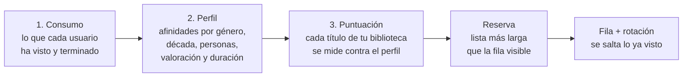

<div align="center">


🌐 &nbsp;[**English**](README.en.md)&nbsp; · &nbsp;**Español**

<br>

# 🎬 JellyTrend

**Plugin para Jellyfin 12** que mantiene la lista de tendencias de TMDB emparejada con tu
biblioteca, publica dos canales (*Trendings* y *Recomendados*) en todos los clientes y arma
una fila personal para cada usuario a partir de lo que ese usuario ve.

<br>

[](https://github.com/BORNIOS/JellyTrend/commits/main)
[](https://github.com/BORNIOS/JellyTrend/actions/workflows/build.yaml)
[](https://jellyfin.org)
[](https://github.com/BORNIOS/JellyTrend/releases)
[](https://github.com/BORNIOS/JellyTrend/releases)
[](LICENSE)

[](https://discord.jellyfin.org)
[](https://www.reddit.com/r/jellyfin)

</div>

---


<p align="center"><em>El carrusel en la página de inicio: sinopsis, nota y los botones «Reproducir» y «Ver detalles».</em></p>

---

## 🆕 Qué trae la versión 3.0.0

Esta versión cambia **cómo se recomienda** y **dónde viven los datos**. La instalación es la de
siempre: la lista de tendencias ya no es lo importante, el **perfil de cada usuario** sí.

| Novedad | Qué significa para ti |
|---|---|
| 🧠 **Aprende el gusto de cada usuario** | El motor resume lo que cada uno ha visto, aprende sus afinidades (géneros, décadas, personas, valoraciones, duración…) y puntúa cada título de tu biblioteca contra ese perfil. Ya no es solo «lo mejor valorado en TMDB». |
| 🌱 **Arranque en frío** | Mientras un usuario no ha visto suficientes títulos, su fila se arma con lo que ve el resto del servidor. En cuanto alcanza el mínimo, pasa a perfil propio. El mínimo es configurable. |
| 🔁 **Reserva y rotación** | La lista guardada es **más larga que la fila visible**, así que cada cierto tiempo la fila empieza en otro punto y lo ya visto se va salpicando sin que la fila se acorte. |
| 🎚️ **Reparto series / películas** | El canal de *Trendings* reserva un porcentaje de la lista a series y el resto a películas; los huecos los rellena el otro tipo, así la lista nunca sale corta. |
| 👥 **Un canal por usuario, sin fugas** | Los ítems de canal se materializan para **todos** los usuarios (ya no dependen de que alguien abra el canal) y cada canal guarda su propia caché por usuario: lo que ve uno no se cuela en la fila de otro. |
| 🧩 **Panel nuevo, homologado con el proveedor PostgreSQL** | Cuatro pestañas, icono propio en la barra lateral, textos en inglés y español, y estado real del almacenamiento (backend, esquema, carpeta y archivos que hay de verdad en disco). |
| 🗄️ **Almacén opcional en PostgreSQL** | Si tienes el proveedor de base de datos, los datos viven en un **esquema propio** (`jellytrend`) con historial. Los JSON quedan solo como copia de cortesía. |
| 🕘 **Historial de corridas** | Cada ejecución de las tareas se registra (resultado, usuarios, duración) y se ve en la pestaña **Actividad** junto al resultado de la última corrida. |
| ⚡ **Aprende al terminar de ver algo** | El perfil se refresca con los eventos de reproducción, sin esperar a la corrida programada. |

---

## ✨ Lo que hace

- 🎥 **Carrusel estilo Netflix** en la pantalla de inicio del cliente web, personalizado por usuario (oculta lo que ya viste).
- 📡 **Dos canales** en *Canales*, visibles en todos los clientes (web, móvil, Roku, Android TV, iOS…).
- ▶️ **Reproducción 100 % local**: TMDB solo alimenta las listas; la fuente siempre es tu servidor.
- 📚 **Navegación por temporadas** en el canal de *Trendings* (serie → temporada → episodio).
- 🔄 **Sincronía biblioteca ↔ canal**: visto, progreso, favoritos y valoración en ambos sentidos.
- 🔍 **Metadatos enriquecidos** en los ítems del canal (géneros, reparto, estudios, tags, clasificación e imágenes locales), para que no parezcan una copia.

---

## ⚙️ Requisitos

| | |
|---|---|
| **Servidor** | Jellyfin compatible con `Jellyfin.Controller` **12.1.x** |
| **TMDB** | Clave de API gratuita en [themoviedb.org/settings/api](https://www.themoviedb.org/settings/api) |
| **Opcional** | [Jellyfin Database Providers: PostgreSQL](https://github.com/BORNIOS/Jellyfin-Database-Providers-Postgres) para el almacén con historial |

> ℹ️ El plugin **solo muestra contenido que ya existe en tu biblioteca**. Si una tendencia de TMDB
> no coincide con ningún ítem tuyo, no se muestra. Es el comportamiento esperado.

---

## 🚀 Instalación

### Opción A — Desde el repositorio (recomendada)

1. En Jellyfin ve a **Panel → Complementos → Repositorios**.
2. Pulsa **Añadir repositorio** y usa la URL del *manifest*:

   ```
   https://raw.githubusercontent.com/BORNIOS/JellyTrend/main/manifest.json
   ```
3. Guarda, ve al **Catálogo**, busca **JellyTrend** e **Instala**.
4. Reinicia Jellyfin cuando lo pida.
5. Ve a **Panel → Complementos → JellyTrend** y configura tu clave de TMDB.

### Opción B — Manual

1. Descarga la última versión desde [**Releases**](https://github.com/BORNIOS/JellyTrend/releases).
2. Copia el `.dll` en la carpeta de complementos de tu instalación.
3. Reinicia Jellyfin y configura la clave de TMDB.

> 💡 Carpetas habituales de complementos:
> - **Linux / Docker:** `/config/plugins/`
> - **Windows:** `%LOCALAPPDATA%\jellyfin\plugins\`

---

## 🎛️ El panel, pestaña por pestaña

El panel es la única interfaz del plugin: cuatro pestañas con todo el ajuste y todo el estado.
Las capturas están hechas con el cliente en español; el panel **sigue el idioma de cada usuario**
(inglés y español incluidos).

### 📈 Trendings


| Ajuste | Para qué sirve |
|---|---|
| **Clave API de TMDB** | Obligatoria. Pega el valor de *API Key (v3 auth)*, no el token de lectura |
| **Idioma TMDB (BCP-47)** | Idioma de los títulos y sinopsis que devuelve TMDB (p. ej. `es-MX`) |
| **Región TMDB (ISO 3166-1 alpha-2)** | País con el que se orienta la lista de tendencias (p. ej. `MX`) |
| **Activar canal de Trendings** | Publica el canal en *Canales* de todos los clientes |
| **Nombre del canal** | Cómo aparece en *Canales* (por defecto `Tendencias`) |
| **Máximo de ítems de Trendings** | Cuántos títulos en tendencia guarda el canal |
| **Mostrar series de TV** | Incluye series junto a las películas; desmárcalo para dejar solo películas |
| **Porcentaje de la lista para series** | Porción reservada a series; las películas toman el resto y los huecos se rellenan |
| **Activar carrusel en la página de inicio** | Inyecta el carrusel en la página de inicio del cliente web |

> El canal se **ofrece** a todos los clientes. Lo que cada usuario ve en su inicio lo decide él
> mismo en **Perfil → Inicio**, y el plugin no pasa por encima de eso.

### ✨ Recomendaciones


| Ajuste | Para qué sirve |
|---|---|
| **Activar fila de Recomendaciones** | Publica el canal personal de cada usuario |
| **Mostrar «Recomendados» en Canales** | Publícalo en la lista de *Canales* de los clientes |
| **Nombre del canal** | Cómo aparece en *Canales* (por defecto `Recomendados`) |
| **Máximo de recomendaciones por usuario** | Cuántos títulos se arman para cada usuario |
| **Rotar la fila cada N horas** | Cada cuánto cambia la fila de punto de partida dentro de la lista guardada. `0` empieza siempre por lo mejor puntuado |
| **Títulos generados por cada título visible** | La reserva: con `2` se guardan el doble de títulos, que son los que reemplazan lo que el usuario ya vio. Más reserva = corridas más largas |
| **Títulos vistos necesarios para tener perfil** | Hasta llegar a esa cantidad de títulos vistos, la fila muestra lo que ve el resto del servidor |

### 💾 Almacenamiento


| Objeto | Qué dice |
|---|---|
| **Carpeta en uso / Origen** | Dónde se escriben los archivos del plugin y de dónde sale esa carpeta (por defecto o personalizada) |
| **Carpeta de los JSON** | Carpeta absoluta opcional. Vacío usa la carpeta de datos del servidor, que es la que sobrevive a una actualización |
| **Archivos de la carpeta de datos** | Lo que hay de verdad en disco, con tamaño y fecha. Las tareas los regeneran, así que se pueden borrar |
| **Proveedor de base de datos** | Si hay proveedor instalado, los datos viven en su esquema y los JSON son solo copia de cortesía |

### 📋 Actividad


| Objeto | Qué dice |
|---|---|
| **Estado actual** | Versión, almacén y versión del esquema, carpeta, TMDB, caché con la última sincronización, canales publicados y ajustes del motor en una línea |
| **Tareas programadas** | Última corrida de cada tarea del plugin, resultado con color y duración |
| **Acciones** | **Sincronizar Trendings ahora** y **Generar Recomendaciones ahora**, sin esperar al calendario |
| **Recomendaciones por usuario** | Elige un usuario y verás el perfil que se aprendió de lo suyo y los títulos en cola para su fila |

---

## 🧠 Cómo aprende el gusto de cada usuario

Tres pasos, en cada corrida de recomendaciones:


```mermaid
flowchart LR
  A["1. Consumo<br/>lo que cada usuario<br/>ha visto y terminado"] --> B["2. Perfil<br/>afinidades por género,<br/>década, personas,<br/>valoración y duración"]
  B --> C["3. Puntuación<br/>cada título de tu biblioteca<br/>se mide contra el perfil"]
  C --> D["Reserva<br/>lista más larga<br/>que la fila visible"]
  D --> E["Fila + rotación<br/>se salta lo ya visto"]
```

- **Las afinidades se normalizan por familia**: una familia (por ejemplo *actores*) se reparte su
  propio peso, así que una afinidad muy concreta no aplasta a un género entero.
- **Afinidades combinadas**: además de lo anterior, el motor aprende pares cruzados (un actor *y*
  una década, un género *y* una duración) y suma un extra cuando un título los cumple.
- **La intensidad de la interacción cuenta**: no pesa igual terminar un título que dejarlo a medias,
  ni marcarlo como favorito.
- **Calidad como desempate**: las calificaciones de TMDB y de tu biblioteca deciden entre títulos
  igual de afines, nunca por encima del gusto.
- **Sin perfil todavía**: cuando el usuario no ha visto lo suficiente, la fila se arma con la
  **popularidad local** (lo que ve, marca y termina el resto del servidor) y sube a perfil propio
  automáticamente.

---

## ⚡ Almacenamiento: archivos JSON o base de datos

JellyTrend funciona con cualquier base de datos que use Jellyfin (SQLite por defecto). Además,
**detecta solo** si tienes instalado el proveedor
[**Jellyfin Database Providers: PostgreSQL**](https://github.com/BORNIOS/Jellyfin-Database-Providers-Postgres)
y entonces guarda todo en un **esquema propio** (`jellytrend`) dentro de tu base:

| | |
|---|---|
| **Sin proveedor** | Los datos viven en los archivos JSON de la carpeta de datos del servidor |
| **Con proveedor** | Los datos viven en el esquema `jellytrend` (caché de características, tendencias, perfiles, recomendaciones, elementos ocultos e historial de corridas) y los JSON se siguen escribiendo **solo como copia de cortesía** |

> ✅ No hay que configurar nada: si el proveedor está, se usa; si no, el plugin funciona igual.
> El esquema lo crea el plugin la primera vez y **nunca toca las tablas de Jellyfin**.

---

## 📡 Los dos canales


<p align="center"><em>Los dos canales en «Mis medios» y sus filas en el inicio: «Últimas - Recomendados» y «Últimas - Tendencias».</em></p>

### Trendings

- Muestra las películas y series en tendencia de TMDB que **ya tienes en tu biblioteca**
  (emparejadas por `TMDB id` durante la sincronización). **Nunca muestra contenido que no tengas.**
- **Películas**: reproducibles directamente desde tu biblioteca.
- **Series**: aparecen como carpetas y se navegan por temporadas para que elijas desde dónde empezar.

### Recomendados

- Canal **por usuario**, armado con lo que ese usuario ha visto.
- **Oculta lo ya visto y lo en progreso.**
- Rota el punto de partida cada N horas (configurable) usando la reserva de títulos guardada.

---

## ⏱️ Tareas programadas

El plugin registra dos tareas en **Panel → Tareas programadas**, y ahí es donde se cambia su
**horario** (el plugin no impone ninguno):

| Tarea | Qué hace |
|---|---|
| **JellyTrend: Sync Trending Content** | Refresca la lista de TMDB, la empareja con tu biblioteca y materializa los ítems de canal de todos los usuarios |
| **JellyTrend: Build Recommendations** | Reconstruye el perfil de cada usuario y genera su lista con la reserva configurada |

Cada corrida queda registrada (resultado, usuarios procesados y duración) y se ve en la pestaña
**Actividad**, donde también hay botones para lanzarlas a mano.

---

## 📁 Rutas de archivos

Todo lo del plugin vive dentro del directorio de datos de Jellyfin (`{DataDir}`):
`%LOCALAPPDATA%\jellyfin` en Windows, `/config` en Linux/Docker.

| Qué | Ruta |
|---|---|
| Complemento (DLL) | `{DataDir}/plugins/JellyTrend_3.0.0.0/` |
| Configuración del plugin | `{DataDir}/plugins/configurations/Jellyfin.Plugin.JellyTrend.xml` |
| Datos del plugin | `{DataDir}/data/JellyTrend/` |
| Perfil de cada usuario | `{DataDir}/data/JellyTrend/perfil-{userId}.json` |
| Lista guardada por usuario | `{DataDir}/data/JellyTrend/recommendations/{userId}.json` |
| Volcado de cortesía del almacén | `{DataDir}/data/JellyTrend/volcado-almacen.json` |
| Arte de los canales | `{DataDir}/metadata/channels/` |

> 🗑️ **Reiniciar las recomendaciones de un usuario:** borra su archivo de `recommendations/`
> (o vuelve a lanzar la tarea). Con proveedor de base de datos, ejecuta
> «Generar Recomendaciones ahora» desde la pestaña **Actividad**.

---

## 🖼️ Personalizar las imágenes de los canales

Por defecto las imágenes de los canales (*Trendings* y *Recomendados*) vienen embebidas en el
plugin. Jellyfin guarda el arte de los canales en `{DataDir}/metadata/channels/`:

- **Windows:** `%LOCALAPPDATA%\jellyfin\metadata\channels\`
- **Linux / Docker:** `/config/metadata/channels/`

Para personalizarlas, localiza la carpeta del canal, **sustituye el archivo de imagen** por el tuyo
(mismo nombre) y reinicia Jellyfin. También puedes reemplazar `channel-trendings.png` y
`channel-recommendations.png` en `Resources/` del código y recompilar.

---

## ❓ Preguntas frecuentes

<details>
<summary><b>¿Por qué la fila o el canal no muestran nada?</b></summary>

1. Comprueba que la **clave TMDB** esté puesta y que haya conexión.
2. Mira la pestaña **Actividad**: si la tarea terminó **con error**, el resultado aparece en rojo,
   y en **Acciones** puedes lanzarla otra vez a mano.
3. Recuerda que el plugin **solo muestra contenido que ya tienes**. Si ninguna tendencia coincide
   con tus ítems, la lista sale vacía y es lo esperado.
</details>

<details>
<summary><b>¿Por qué la lista guarda 50 títulos si en la fila veo 20?</b></summary>

Es intencionado: la **reserva**. La fila visible es corta, pero se guardan más títulos detrás para
que la rotación pueda reemplazar lo que el usuario ya vio sin que la fila se acorte. Se controla con
**Títulos generados por cada título visible**.
</details>

<details>
<summary><b>¿Por qué un usuario nuevo ve recomendaciones si no ha visto nada?</b></summary>

Es el **arranque en frío**: hasta que no alcanza el mínimo de títulos vistos, su fila se arma con lo
que ve el resto del servidor. En cuanto llega al mínimo, pasa a su perfil propio.
</details>

<details>
<summary><b>¿Puedo forzar que un usuario vea el canal en su inicio?</b></summary>

No. El plugin **ofrece** el canal; lo que cada usuario ve en su inicio lo decide él mismo en
Jellyfin (**Perfil → Inicio**). Desmarcar el canal en el panel solo quita el canal de la lista.
</details>

<details>
<summary><b>¿Mis datos salen de mi servidor?</b></summary>

No. La reproducción es 100 % local y las recomendaciones se calculan y se guardan en tu servidor.
TMDB solo se consulta para obtener la **lista de tendencias** (títulos e identificadores) y sus
metadatos.
</details>

<details>
<summary><b>¿Qué pasa si quito el plugin de PostgreSQL?</b></summary>

Nada se pierde: los archivos JSON de la carpeta de datos siguen ahí como **copia de cortesía** y el
plugin vuelve a leer de ellos. El esquema `jellytrend` no afecta a las tablas de Jellyfin.
</details>

<details>
<summary><b>¿Puedo mover los archivos de sitio?</b></summary>

Sí: en la pestaña **Almacenamiento** puedes indicar una carpeta **absoluta** (una ruta relativa se
ignora). Requiere reiniciar el servidor para que todas las tareas la usen, y el panel avisa si la
carpeta indicada no se puede usar.
</details>

---

## 🧩 Compatibilidad y alcance

| | |
|---|---|
| **Jellyfin** | 12.1.x (`net10.0`) |
| **Base de datos** | Cualquiera que use Jellyfin; el almacén propio requiere el proveedor PostgreSQL |
| **Contenido** | Solo películas y series **de tu biblioteca**; el canal de *Recomendados* arma solo películas |

---

## 📄 Licencia

Este proyecto se distribuye bajo la licencia incluida en [LICENSE](LICENSE).

---

<div align="center">

Hecho con ☕ para la comunidad de Jellyfin.

**[⬆ Volver arriba](#-jellytrend)**

</div>
